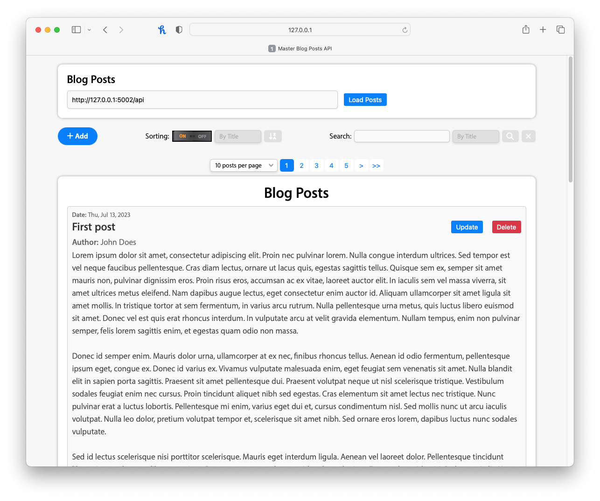

# Masterblog-API

Welcome to the Masterblog-API Application!

MasterBlog is a powerful web application that seamlessly integrates API implementation, offering full support for CRUD operations. CRUD stands for Create, Read, Update, and Delete, and with MasterBlog, users can effortlessly manage and interact with their blog posts.

## Features

- Create new blog posts with author, title, and content fields.
- Update existing blog posts by modifying the author, title, or content fields.
- Delete blog posts.
- Like blog posts: Increment the count of likes by engaging with blog posts.
- JSON storage to persistently store all posts in a JSON file.
- Search options by Title, Author, Content, and Date within the posts.
- Sorting of posts by Title, Author, Content, and Date.
- Sorting of search results by Title, Author, Content, and Date.
- Implementation of Pagination
- Aesthetic blog design and layout achieved through CSS and JavaScript
- Robust error handling.
- Utilization of both custom-defined and standard dialog boxes

## Getting Started

To get started with the Masterblog-API application, follow these steps:

1. Clone the repository from GitHub:

   ```shell
   git clone git@github.com:rsfsalman/Masterblog-API.git
   ```
   
2. Run the application:
   ```shell
   run both 'backend_app.py' and 'frontend_app.py'
   ```
   ```shell
   Access the application in your web browser at http://localhost:5001.
   ```
## Usage

<ul style="list-style-type:square">
   <li>Create a new blog post</li>
   <ul style="list-style-type:disc">
      <li>Click on the "Add Post" button on the home page.</li>
      <li>Fill in the author, title, and content fields in the provided form.</li>
      <li>Click the "Submit" button to create the post.</li>
   </ul>

   <li>Update a blog post</li>
   <ul style="list-style-type:disc">
      <li>Locate the desired post on the home page and click on the "Update" button within its corresponding section.</li>
      <li>Fill in the author, title, and content fields in the provided form.</li>
      <li>Click the "Update" button to create the post.</li>
   </ul>

   <li>Delete a blog post</li>
   <ul style="list-style-type:disc">
      <li>Locate the desired post on the home page and click on the "Delete" button within its corresponding section.</li>
   </ul>

   <li>Like a blog post</li>
   <ul style="list-style-type:disc">
      <li>Locate the desired post on the home page and click the "Like" button to increment the likes count.</li>
   </ul>
   <li>Arranging posts</li>
    <ul style="list-style-type:disc">
        <li>To arrange the posts, activate the sorting feature and choose your preferred sorting criteria, such as title, content, author, or date. Additionally, indicate the desired sorting order, from the sorting menu.</li>
        <li>You can determine the sorting order—either ascending or descending—by clicking the sort order button.</li>
    </ul>
    <li>Searching in posts</li>
    <ul style="list-style-type:disc">
        <li>You can initiate a search by entering text into the search field and specifying the search criteria from the menu.</li>
        <li>Additionally, you have the option to sort the search results.</li>    
    </ul>
</ul>

## File Structure
```shell
Masterblog-API/
  ├── backend/
  │   ├── database/
  │   │   ├── blog_posts.json
  │   │   └── data_handler.py
  │   └── backend_app.py
  ├── frontend/
  │   ├── static/
  │   │   ├── css/
  │   │   │   ├── styles.css
  │   │   │   └── blog_posts.css
  │   │   ├── fonts/
  │   │   │   ├── myriad-set-pro_bold.ttf
  │   │   │   ├── myriad-set-pro_semibold.ttf
  │   │   │   ├── myriad-set-pro_text-italic.ttf
  │   │   │   ├── myriad-set-pro_text.ttf
  │   │   │   └── myriad-set-pro_thin.ttf
  │   │   ├── images/
  │   │   │   ├── alert_caution_badge_icon.png
  │   │   │   ├── menu-arrow-icon.png
  │   │   │   ├── sorting_off_state.png
  │   │   │   └── sorting_on_state.png
  │   │   ├── js/
  │   │   │   └── main.js
  │   │   └── sounds/
  │   │       └── Uh oh.mp3
  │   └── templates/
  │       └── index.html
  ├── hero.png
  └── README.md
```

## Contributing
Contributions to the Masterblog-API project are welcome! If you find any issues or have suggestions for improvements, 
please create an issue on the [GitHub repository](https://github.com/rsfsalman/Masterblog-API/issues).

## Contact
For any inquiries or further information, please feel free to reach out to me:

GitHub: [rsfsalman](https://github.com/rsfsalman)

# App in Action
#### Screenshots of Masterblog-API in Operation

*The home screen of the app showcasing the main index page, where all the blog posts are displayed.*
<br>
<br>
